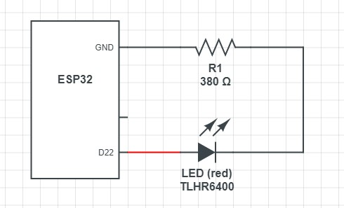
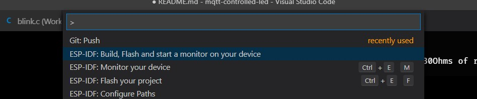

# MQTT connected LED


## Brief


Making a LED controllable through MQTT

\
\


## Circuit

\
Created with [CircuitLab](https://www.circuitlab.com/editor/)

### Resistor

```
I = 10mA = 0.01A
U = 3.3V
R = U / I 
  = 3.3/0.01 = 330Ohm
  = The resistor has to have at least 330Ohms of resistance
```


## Configuration

Use `idf menuconfig` to configure the necessary variables


## Running

```powershell
idf build
idf -p COM12 flash
idf -p COM12 monitor
```

or use Visual Studio Code commands




After booting:
1. a wireless connection will be setup
1. a connection to the MQTT broker established

There are two topics used for MQTT messaging:
* Control: Listens for control-messages / subscribes to the broker
* Data:    Outgoing messages are sent on this channel


You can use the public mqtt-broker to test it:

* https://www.hivemq.com/public-mqtt-broker/
    * http://www.hivemq.com/demos/websocket-client/
    * `{ "led_state": 0 }`
    * `{ "led_state": 1 }`

