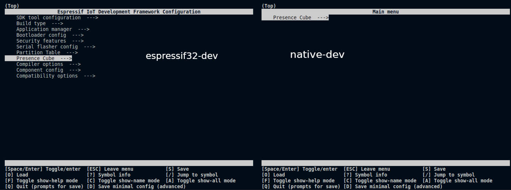

# Zube App

A network connected information cube with lighting capabilities

## Coding Guidelines

See [CODING_GUIDELINES.md]

- [Testing](./test)
- Library Management
  - [Libraries](./lib)
  - [Components](./components)
- [Electrical Circuitry](./circuits/)
- [Configuration](./config)

<!-- old readme below -->

## Brief

The functionality of the cube is intended to be a form of information cube. It is edge-connected and capable of receiving commands via MQTT. These commands can span from simple "display text x" to "switch into mode y"

## Setup

> Scripts are written in powershell to be as platform independent as possible. Make sure to install pwsh on your
> non-windows systems:\
> https://learn.microsoft.com/en-us/powershell/scripting/install/installing-powershell-on-linux

1. The project uses submodules, so you will have to clone recursively

   ```powershell
   git clone --recursive <url>

   # if already cloned
   git submodule init
   git submodule update --recursive
   ```

1. Review configuration
   ```pwsh
   # https://docs.platformio.org/en/latest/core/userguide/cmd_settings.html
   ./invoke-pio.ps1 settings get
   ./Edit-ProjectConfig.ps1 -environment native-dev
   ```

1. Build environments at least once to ensure that platform io has pulled all the necessary dependencies
   ```powershell
      ./build_env.ps1 -Environments native-dev
   ```

1. Ensure the setup is working
   ```powershell
      ./test_native.ps1
   ```

> Be careful when cloning in low-connectivity networks. If encountering issues during cloning
> better remove the whole repo and clone anew in a more stable network to prevent unnecessary
> troubleshooting.

### Development Environment

The project uses [PlatformIO](https://platformio.org/) so you will have to install the a PlatformIO supported IDE and the corresponsing plugin.

Choosing VSCode, opening the folder should prompt you with all the recommended plugins automatically. If it does not, please refer to the [PlatformIO] documentation and the projects [.vscode/extensions.json] up-to-date install instructions.

[.vscode/extensions.json]: ./.vscode/extensions.json

### Filesystem with fonts

To display text onto the display, fonts need to be available to the device. These are stored on the devices filesystem. To flash the fonts onto the devices flash, plug in the device and exectute these steps once

<!-- TODO: This might be simplifiable via platformio 
           https://github.com/RobustoFramework/Multi-platform-Multi-board/blob/main/platformio.ini -->

```powershell
./invoke-pio.ps1 run --target buildfs --environment espressif32-dev
./invoke-pio.ps1 run --target uploadfs --environment espressif32-dev
```

### Configuration

## Usage configuration

Configuration has been abstracted by a powershell script that knows how to handle 
the different requirements of each environment. Use this script to configure your app:

```powershell
# In some cases the arrow keys aren't working. Use alternative `J`,`K` bindings
Get-Help ./Edit-ProjectConfig.pd1 -Detailed
```



> Note that configuration is not filtered depending on environment needs.
> So you will find items that are not applicable in certain environments.
> For instance `CONFIG_WIFI_SSID` can can be ignored in native. Ignoring
> only causes problems if there's no fallback value defined yet. Should 
> you come across such an item, create a dummy value in `sdkconfig.defaults`.

## **Development** configuration

Sometimes, libraries include custom configuration values. Unless these libraries are ESP-libraries, this means that you will have to integrate these values into your projects menuconfig. This can be done using a `powershell` script

```powershell
./scripts/Setup-Dependencies.ps1
```

## Running

All the steps necessary are performed using the PlatformIO's sidebar or CLI

```powershell
./invoke-pio.ps1 run --target upload --target monitor --environment espressif32-dev
```

## Manual test

The most direct way of testing the devices functionality are to use the provided scripts

```bash
./scripts/set-hud.sh --ip <cube-ip>
./scripts/set-color.sh --ip <cube-ip>
```

## Tooling

- Basic Multimeter
- Dupont Crocodile Clamps for simpler troubleshooting
- Preciva PR-3254 Dupont Ratcheting Crimper Plier for both Dupont- and JST cables

## Troubleshooting

Here are a few common errors maintainers have been facing :)

1. [🐞 Issue: After freshly cloning the project, I am unable to build / flash / upload it to the device](#83)
1. [🐞 Issue: Unable to upload / flash to the device: [upload] Error 134 no device found](#84)
1. [🐞 Bug: PlatformIO headers are not detected](#75)

## References

- [CODING_GUIDELINES.md]

[CODING_GUIDELINES.md]: /docs/CODING_GUIDELINES.md
